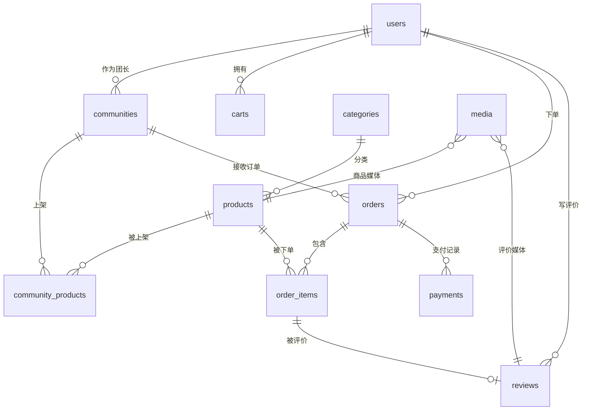

# 数据库设计

## ER 图

## 表设计

> 约定：所有表含 `id`(PK, 自增)、`created_at`、`updated_at`。

### 1. users

| 字段          | 类型                    | 说明        |
| ------------- | ----------------------- | ----------- |
| username      | varchar(50)             | 唯一        |
| password_hash | varchar(100)            | bcrypt      |
| phone         | varchar(20)             |             |
| avatar        | varchar(255)            | 头像 URL    |
| role          | enum(user,leader,admin) | 默认 user   |
| status        | enum(active,banned)     | 默认 active |

- UNIQUE(username)

### 2. communities（社区自提点）

| 字段      | 类型                | 说明        |
| --------- | ------------------- | ----------- |
| name      | varchar(100)        |             |
| address   | varchar(255)        |             |
| leader_id | bigint              | FK users.id |
| status    | enum(active,closed) |             |

- INDEX(leader_id)

### 3. categories

| 字段      | 类型        | 说明          |
| --------- | ----------- | ------------- |
| name      | varchar(50) |               |
| sort      | int         | 排序          |
| parent_id | bigint      | NULL=一级分类 |

### 4. products

| 字段        | 类型          | 说明       |
| ----------- | ------------- | ---------- |
| category_id | bigint        | FK         |
| name        | varchar(100)  |            |
| description | text          |            |
| cover_url   | varchar(255)  |            |
| video_url   | varchar(255)  | 可空 ★视频 |
| price       | decimal(10,2) | 平台基准价 |
| unit        | varchar(20)   | 斤/份/箱   |
| status      | enum(on,off)  |            |

- INDEX(category_id, status)

### 5. community_products（社区商品，关键表）

| 字段         | 类型          | 说明     |
| ------------ | ------------- | -------- |
| community_id | bigint        | FK       |
| product_id   | bigint        | FK       |
| stock        | int           | 本团库存 |
| price        | decimal(10,2) | 本团价   |

- UNIQUE(community_id, product_id)
- INDEX(community_id, product_id)

### 6. carts

| 字段                              | 类型   |
| --------------------------------- | ------ |
| user_id, product_id, community_id | bigint |
| quantity                          | int    |

- UNIQUE(user_id, product_id, community_id)

### 7. orders

| 字段                  | 类型                                                             | 说明 |
| --------------------- | ---------------------------------------------------------------- | ---- |
| order_no              | varchar(32)                                                      | 唯一 |
| user_id, community_id | bigint                                                           | FK   |
| total_amount          | decimal(10,2)                                                    |      |
| status                | enum(pending,paid,shipped,completed,canceled,refunding,refunded) |      |
| remark                | varchar(255)                                                     |      |
| paid_at               | datetime                                                         |      |

- UNIQUE(order_no)
- INDEX(user_id, created_at)
- INDEX(community_id, status)

### 8. order_items

| 字段                 | 类型          | 说明       |
| -------------------- | ------------- | ---------- |
| order_id, product_id | bigint        | FK         |
| product_name         | varchar(100)  | 冗余，快照 |
| product_price        | decimal(10,2) | 冗余，快照 |
| quantity             | int           |            |
| subtotal             | decimal(10,2) |            |

### 9. payments

| 字段     | 类型                         |
| -------- | ---------------------------- |
| order_id | bigint                       |
| amount   | decimal(10,2)                |
| method   | enum(mock)                   |
| status   | enum(pending,success,failed) |
| paid_at  | datetime                     |

### 10. reviews

| 字段                   | 类型         | 说明     |
| ---------------------- | ------------ | -------- |
| user_id, order_item_id | bigint       |          |
| rating                 | tinyint      | 1-5      |
| content                | text         |          |
| images                 | json         | URL 数组 |
| video_url              | varchar(255) | ★视频    |

- INDEX(order_item_id)

### 11. media

| 字段       | 类型                 | 说明          |
| ---------- | -------------------- | ------------- |
| owner_type | enum(product,review) |               |
| owner_id   | bigint               |               |
| type       | enum(image,video)    |               |
| url        | varchar(255)         |               |
| cover_url  | varchar(255)         | 视频封面      |
| size       | bigint               | 字节          |
| duration   | int                  | 秒            |
| status     | enum(uploading,done) | L2 分片上传用 |

- INDEX(owner_type, owner_id)

### 12. upload_chunks（L2 分片上传用）

| 字段         | 类型         |
| ------------ | ------------ |
| file_hash    | varchar(64)  |
| chunk_index  | int          |
| total_chunks | int          |
| chunk_path   | varchar(255) |
| media_id     | bigint       |

- UNIQUE(file_hash, chunk_index)
